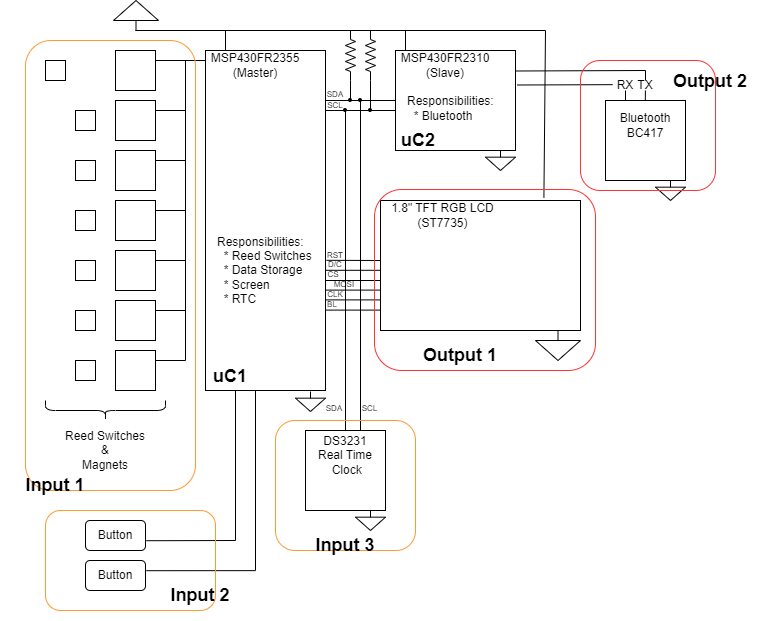

# EELE465_Final_7DayPillOrg_DS3231_BC417_ST7735
7 Day pill organizer (Final project for EELE465)

https://github.com/bitbytebitco/EELE465_Final_7DayPillOrg_DS3231_BC417_ST7735/assets/45221627/b8cc05bc-4acd-4f87-b44e-6eee890f8a78

## Capabilities
* Display screen for Date and Time
* Display screen for daily consumption (GREEN or RED background)
* Display screen for weekly consumption
* Display screen for monthly consumption
* Ability to export files to Bluetooth endpoint

## System Diagram

## Components
* MSP430FR2355 - (master controller)
  * 16 Mhz Clock Speed
  * Using Digitally Controlled Oscillator
    * Necessary for higher LCD framerate
* MSP430FR2310 (slave controller)
* I2C Peripheral
  * 400 kHz
  * Master/Slave (2355 → 2310)
  * Master/Slave (2355 → DS3231 RTC)
* SPI
  * 1.8” RGB TFT LCD
* Bluetooth (BC417)
